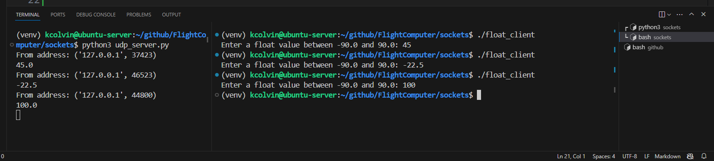

## Demo UDP client and server:
### First, let's just use Python to Python sockets. To run this demo:
Open a terminal and run the server program: python3 udp_server.py 
Open a 2nd terminal on the same computer and run: python3 udp_client.py

When you type into the client, the message will be displayed on the server.

I've commented it pretty well, but I imagine there is some terminology that you might not know.  I'm learning to use Github Copilot. It will be able to answer your questions easily and explain the code. I used copilot to develop this example.

My suggestions to expand this code:
- Integrate the voltz_actuator code into the server so it will actually move the servo. Then, you can move the servo from the UDP client over a UDP socket connection.
- Implement unit testing on the UDP client. Test for range of values, type of input (strings, integers, other types), and any other test you can imagine.
- Think about how we will make the "master" or "time master" as Paulo/Carl call it. Will we have a single UDP server and many UDP clients?

### Next, let's create an example in C.
The idea is that we use C where necessary. Since we have lots of C code from the RTD company, let's leverage their code, then add what is necssary.

For example, we could use their code to read analog sensors, pick out the values we want, then use UDP sockets to send these numbers to a Python UDP server for processing. This using C, but getting data into Python using sockets.

Open up the file "float_client.c". This program calls a function udp_send_float(float, port), which sends a float number to the local host on port 12345, the closes the connection. The udp_send_float() function is defined in the udp_send_float.c program. 

To run this example: 
- Open a terminal and run the same Python UDP server program: python3 udp_server.py 
- Next, open another terminal an run the program ./float_client. 

Once you input the float value, it will create a UDP socket, send the float, then close the socket. You should see the number displayed in the server program:

To compile the C program, here is the command: 
gcc -o float_client float_client.c udp_send_float.c

#### Added by Kurt on 3/5/24

